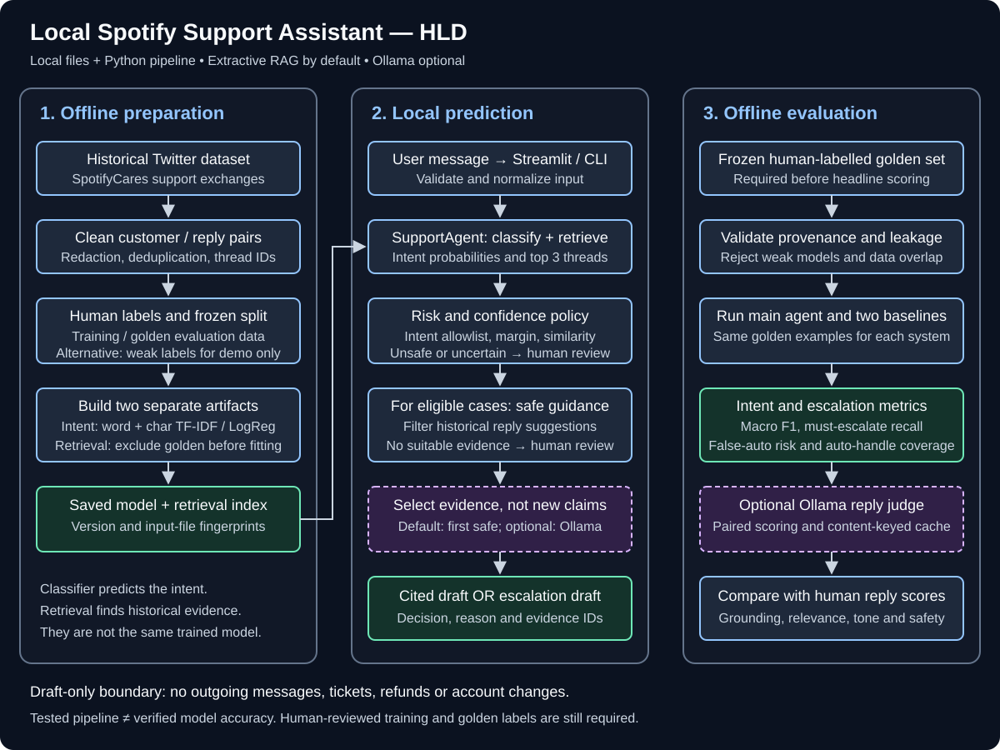
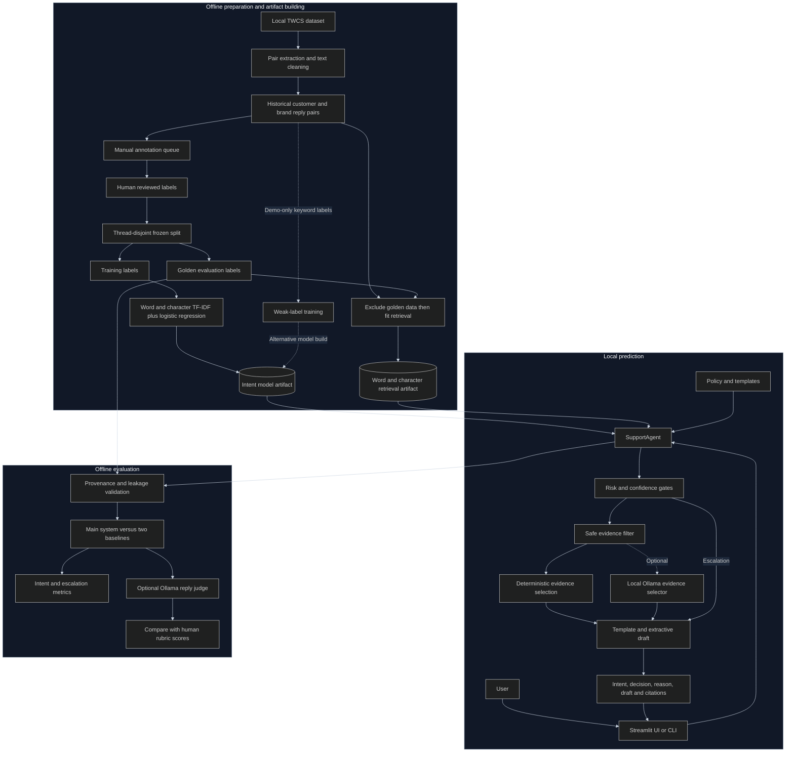
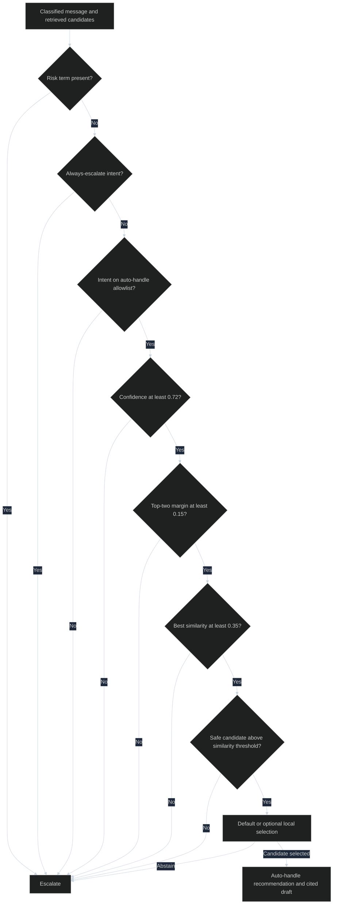
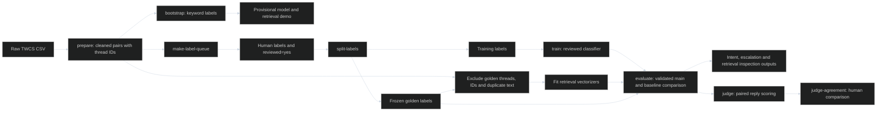

# Architecture and file-by-file guide

This guide describes the technical architecture and module interactions of the local Spotify support assistant. See [the project README](../README.md) for quickstart and setup instructions.


## 1. What is this project?

It is a **customer-support decision assistant**, not an autonomous support employee.
Given a message, it predicts the issue type, finds similar historical support
exchanges, recommends automatic handling or human review, and produces a draft.
The current data source is Kaggle's Customer Support on Twitter dataset, filtered
to SpotifyCares. Historical replies are examples, not verified current policy.

Think of the system as three cooperating parts:

1. **Classifier:** “What problem is this customer reporting?”
2. **Retriever:** “Which past conversations look similar?”
3. **Policy and drafter:** “Is this safe enough to draft from evidence, or should
   a human review it?”

The word *agent* here means a Python orchestrator. There is no tool-calling
planning loop, account access, payment operation, outgoing message integration,
or persistent multi-turn conversation memory.

### Glossary

| Term | Meaning in this project |
|---|---|
| Intent | A category such as playback problem, account access or billing. |
| TF-IDF | A numerical representation emphasizing informative words or character fragments. |
| Logistic regression | The supervised classifier that predicts intent probabilities. |
| Cosine similarity | How closely a query vector points in the same direction as a historical-message vector. |
| RAG | Retrieval-augmented response construction; here it is extractive/template-based by default. |
| Evidence | A retrieved customer/brand-reply pair with traceable tweet and thread IDs. |
| Weak label | An intent inferred by keyword rules, not independently verified by a person. |
| Golden set | A frozen human-labelled evaluation dataset not used for training or retrieval fitting. |
| Leakage | Test information appearing in training/retrieval, making scores look better than they are. |
| Escalation | A recommendation for human review, not creation of a real support ticket. |

## 2. HLD — high-level design

The image below has an opaque dark background and high-contrast labels, so its
readability does not depend on the editor theme or Mermaid support.
Use **Open Preview** (`Ctrl+Shift+V`) to view this document as rendered Markdown.
For a larger view, open the [standalone HLD diagram](diagrams/hld.svg).



### Detailed component diagram (Mermaid)

The diagrams below use an explicit dark palette. If your Markdown preview shows
Mermaid source instead of diagrams, use the standalone HLD above; that image
requires no Mermaid extension or network access.



**Deployment:** Streamlit and the Python pipeline run on one machine. CSV files
provide storage for datasets/labels; joblib files hold trained artifacts. Optional
Ollama is a separate local process on port 11434. No database, cloud inference
service, REST backend, message broker or GPU is required by the default pipeline.
The prediction UI is not a training UI; models must be built beforehand.

## 3. Online flow — one incoming message

The entry point is [app.py](../app.py) or the `predict` command in
[src/cli.py](../src/cli.py). Both call `SupportAgent.respond()`.

```mermaid
%%{init: {"theme":"dark","themeVariables":{"background":"#0b1220","primaryColor":"#1e293b","primaryTextColor":"#f8fafc","primaryBorderColor":"#93c5fd","lineColor":"#cbd5e1","actorBkg":"#1e293b","actorBorder":"#93c5fd","actorTextColor":"#f8fafc","actorLineColor":"#cbd5e1","signalColor":"#cbd5e1","signalTextColor":"#f8fafc","labelBoxBkgColor":"#1e293b","labelTextColor":"#f8fafc","loopTextColor":"#f8fafc","noteBkgColor":"#172554","noteTextColor":"#f8fafc"}}}%%
sequenceDiagram
    actor User
    participant UI as Streamlit or CLI
    participant Agent as SupportAgent
    participant Model as Intent classifier
    participant Retrieval as Local retrieval index
    participant Policy as Policy rules
    participant Selector as Evidence selector
    User->>UI: Enter customer message
    UI->>Agent: respond(text)
    Agent->>Agent: Validate length and normalize identifiers
    Agent->>Model: Predict intent and top two probabilities
    Model-->>Agent: Intent, confidence, second confidence
    Agent->>Retrieval: Retrieve up to three distinct threads
    Retrieval-->>Agent: Historical candidates and similarity scores
    Agent->>Policy: Check risks, intent allowlist, confidence and evidence
    Policy-->>Agent: Preliminary action and reason
    alt Policy requires escalation
        Agent->>Agent: Template plus human-review recommendation
    else Preliminary auto-handle
        Agent->>Agent: Remove unsafe or weak evidence
        Agent->>Selector: Select safe candidate; optionally use Ollama
        Selector-->>Agent: Candidate, abstention or no evidence
        Agent->>Agent: Evidence-based draft or downgrade to escalation
    end
    Agent-->>UI: Structured result and cited evidence IDs
    UI-->>User: Display draft and decision; send nothing externally
```

### Step-by-step

1. **Load artifacts.** The agent loads the intent model and version-2 retrieval
   index. Missing/old retrieval artifacts fail explicitly.
2. **Validate input.** Reject non-string, empty/identifier-only messages and text
   longer than 4,000 characters.
3. **Normalize.** Replace handles, emails, URLs and long numbers with placeholders.
   Matching vectorizers additionally remove placeholders and casefold text.
4. **Classify.** Return the most likely intent and the two highest probabilities.
5. **Retrieve.** Search historical *customer messages*, then return their paired
   brand replies. Retrieval is not currently filtered by predicted intent.
6. **Apply policy.** Decide whether the case is eligible for automatic drafting.
7. **Filter evidence.** For eligible cases, each candidate must have sufficiently
   high similarity and reusable troubleshooting text passing `safe_guidance()`.
8. **Select.** Default: use the highest-ranked remaining candidate. Optional:
   Ollama returns a candidate index or abstains. It cannot supply reply prose.
9. **Draft.** Combine the intent template with the selected extract, or return a
   template with a human-review recommendation and a no-ticket-created disclaimer.
10. **Return.** Expose the decision, rationale, draft and exact evidence IDs used.

Retrieval happens before the policy call in the current code. A high-risk case
can therefore display historical candidates, but their text is not appended to
its draft and the optional selector is not invoked.

## 4. What the models actually do

### Intent classification

[src/model.py](../src/model.py) builds a scikit-learn pipeline:

- Word unigrams and bigrams: “app”, “pausing”, “app pausing”.
- Character fragments of length 3–5 within word boundaries: useful for related
  spellings and partial matches.
- `FeatureUnion` combines both representations.
- Balanced logistic regression learns an intent classifier from labelled text.
- Each branch allows up to 50,000 features; training uses a fixed random seed.

The nine intents are `account_access`, `billing_subscription`,
`playback_app_issue`, `account_security`, `feature_availability`,
`plan_change_cancel`, `service_outage`, `complaint_feedback`, and `other_unclear`.

**Confidence is not verified correctness.** A model trained on keyword-derived
labels can be highly confident while simply reproducing those rules.

### Retrieval

[src/retrieval.py](../src/retrieval.py) fits separate word and character
vectorizers on eligible historical customer messages. It is a different artifact
from the classifier, even though both use TF-IDF.

For a query and a historical message:

$$
s = 0.65\,\operatorname{cosine}(q_w,d_w)
  + 0.35\,\operatorname{cosine}(q_c,d_c)
$$

The subscripts denote word and character representations. These weights are
defaults, not experimentally proven optimum values. The implementation scores
the indexed corpus, sorts results and returns up to three different threads.
It does not use dense semantic embeddings, a vector database, BM25 or a
cross-encoder. The corpus is capped at 30,000 sampled pairs; each vectorizer
allows up to 40,000 features by default.

### Why call it local RAG?

The reply depends on retrieved evidence rather than only a generic template.
However, unlike typical LLM RAG, the final wording is template plus extracted
guidance. This reduces opportunities for newly invented claims but does not
prove historical guidance is applicable or current.

## 5. Safety and decision flow



Only `account_access`, `playback_app_issue` and `feature_availability` are
eligible. Security, billing and plan changes are explicitly always escalated;
other non-allowlisted intents also escalate.

`safe_guidance()` rejects whole sanitized replies containing specified sensitive
terms, action claims, placeholders or recognizable injection markers. It then
retains only sentences starting with selected troubleshooting forms, such as
“Try”, “Restart”, “Update”, or “Could you check”. This is a restrictive heuristic,
not a verified knowledge base, general prompt-injection defense or safety proof.
Only the top three diverse retrieval candidates are inspected, not every safe
reply in the corpus.

### Ollama has two separate roles

| Role | Module | When used | Output |
|---|---|---|---|
| Optional evidence selector | [src/local_rag.py](../src/local_rag.py) | Prediction, only after policy and safe-evidence gates | Candidate index or abstention |
| Optional reply judge | [src/judge.py](../src/judge.py) | Offline evaluation | Five rubric scores and rationale |

The selector calls `http://127.0.0.1:11434/api/generate`, bypasses environment
proxies, uses a 30-second timeout and temperature zero. Invalid output or network
failure falls back to deterministic selection; explicit abstention escalates.
The judge uses `http://localhost:11434/api/generate`, temperature zero and a
180-second timeout; judge failure is surfaced rather than replaced with fake scores.
Neither role trains the classifier. Live selector responses are not cached;
offline judge scores are content-keyed and cached.

## 6. Offline data, training and evaluation flow



### A. Prepare conversations

`prepare_pairs()` reads the raw CSV in chunks, finds SpotifyCares replies and
joins them to their parent customer tweets. When multiple brand replies exist,
it keeps the first after sorting reply timestamps. It normalizes text, removes
short/unusable rows, retweets and exact customer-text duplicates, and traces
parent tweet IDs to a root `thread_id` with a bounded/cycle-aware walk.

It creates **customer-to-next-brand-reply pairs**, not summaries of resolved
threads. It does not currently implement reliable language detection or
semantic near-duplicate detection.

### B. Two training paths

**Demo path:** `bootstrap` excludes any existing golden rows, removes empty and
normalized duplicate messages, samples up to 12,000 pairs, and generates intents
with ordered keyword rules. It saves a model marked `weak_provisional` and builds
the retrieval index. The manual queue is not the source of these weak labels.

**Reviewed path:** humans fill the annotation queue and mark rows `reviewed=yes`.
`split-labels` retains reviewed rows, validates fields, removes duplicate
normalized messages and duplicate threads, then stratifies by intent. Golden
size defaults to 200 and must be 150–250; at least 100 rows must remain for
training and every represented intent needs at least two examples. Deduplication
keeps one row per thread; it is not a multi-row group-stratification algorithm.

`train` checks the frozen split, fits the classifier and rebuilds retrieval with
golden exclusion. A separate development split for threshold tuning is still
manual future work; the CLI currently writes only training and golden splits.

### C. Why hold out retrieval data too?

If a test customer message is also indexed with its real reply, retrieving that
reply makes evaluation unrealistically easy. The build removes golden thread IDs,
tweet IDs and normalized matching messages **before vectorizer fitting**.

The classifier stores a SHA-256 hash of its training CSV. The retrieval artifact
stores the excluded golden CSV hash and index version. Evaluation checks these
hashes, reviewed-label provenance and actual overlap. Hashes detect changed input
files; they are not proof that labels are correct or artifacts are tamper-proof.

### D. What is measured?

| Measure | Question answered |
|---|---|
| Macro F1 | How well are intents classified when each class contributes equally? |
| Accuracy | What fraction of intent predictions are correct overall? |
| Per-intent report and confusion matrix | Which categories are confused or underserved? |
| Must-escalate recall | Of cases needing a human, how many were escalated? |
| Escalation precision | Of recommended escalations, how many truly needed one? |
| False-auto rate | False automatic decisions divided by must-escalate cases. |
| False-auto fraction among auto-handled | False automatic decisions divided by all automatic decisions. |
| Auto-handle coverage | Automatic decisions divided by all examples. |
| Reply rubric | Relevance, actionability, grounding, tone and safety, each 1–5. |
| Judge/human agreement | Spearman correlation, exact agreement and agreement within one point. |

The two false-auto ratios have different denominators; the implementation also
reports counts. Similarity scores and top retrieval IDs are inspection aids,
not measured retrieval precision/recall. Human relevance scoring is still needed.

Three systems are compared: majority-intent/always-escalate baseline,
keyword baseline, and the main agent. The baselines are deliberately simplistic
comparison systems, not safe alternatives to deploy; their generic text may
contain unsupported promises of human review.

Judge sampling is paired: 50 examples across three systems means 150 outputs.
The score cache keys include model name, rubric version, customer text, draft and
evidence. The latest paired run is kept separately for human agreement. Reusing
a model name after replacing its local weights is not independently detected by
this cache, so clear/version it when changing weights under the same name.

## 7. File-by-file walkthrough

### Application and configuration

| File | Responsibility and what to read |
|---|---|
| [app.py](../app.py) | Streamlit entry point. Sidebar selects optional Ollama; message input calls the agent; displays intent, confidence, decision, draft, reasons, citations, evidence expanders and weak-label warning. Handles validation/missing-index errors. |
| [src/cli.py](../src/cli.py) | `argparse` entry point connecting preparation, training, prediction and evaluation functions. Read `main()` to follow command-to-module calls. |
| [src/config.py](../src/config.py) | Defines `ProjectConfig`; `load_config()` reads YAML and resolves configured data paths relative to the repository root. |
| [config/project.yaml](../config/project.yaml) | Brand, candidate brands, random seed, file paths, nine intents, confidence/risk rules, retrieval sizes and reply templates. Retrieval mixture weights live in retrieval source, not this YAML. |
| [src/schemas.py](../src/schemas.py) | `AgentInput` and `PolicyDecision` dataclasses: explicit contracts for policy inputs/outputs. Not a web API schema. |
| [src/__init__.py](../src/__init__.py) | Package marker/docstring supporting module imports and CLI module execution. |

### Runtime prediction

| File | Important functions and responsibility |
|---|---|
| [src/agent.py](../src/agent.py) | `SupportAgent`, `respond()`, `_draft()`, `require_artifacts()`. Orchestrates prediction, retrieval, preliminary policy, safe evidence selection and final response. |
| [src/model.py](../src/model.py) | `build_intent_pipeline()`, `train_intent_model()`, `load_intent_model()`, `predict_intent()`. Learns and loads intent classification; records label provenance and training-file hash. |
| [src/retrieval.py](../src/retrieval.py) | `exclude_held_out()`, `build_retrieval_index()`, `retrieve()`, `load_retrieval_index()`. Builds a leakage-aware dual TF-IDF index, ranks cases, diversifies threads, rejects legacy indexes. |
| [src/policy.py](../src/policy.py) | `PolicyConfig`, `_matched_risk_terms()`, `decide()`. Applies ordered deterministic escalation gates. Final evidence-related escalation can still happen in the agent. |
| [src/text.py](../src/text.py) | `normalize_text()` redacts; `normalize_for_matching()` removes placeholders and casefolds; `sanitize_reply()` removes greetings/signatures; `safe_guidance()` filters reusable troubleshooting sentences. |
| [src/local_rag.py](../src/local_rag.py) | `select_evidence()`. Deterministic default, optional constrained loopback Ollama selection, abstention and error fallback. |

### Preparation and assessment

| File | Important functions and responsibility |
|---|---|
| [src/data.py](../src/data.py) | `profile_brands()`, `prepare_pairs()`, `make_label_queue()` plus parent-map helpers. Processes raw data in chunks and creates traceable pairs and annotation samples. |
| [src/labeling.py](../src/labeling.py) | Ordered `RULES`, `keyword_intent()`, `create_weak_labels()`, `split_reviewed_labels()`. Maintains the distinction between rule-derived demo data and reviewed evaluation labels. |
| [src/baselines.py](../src/baselines.py) | `majority_label()`, `trivial_prediction()`, `keyword_prediction()`. Simple comparison systems; no retrieval or Ollama. |
| [src/evaluation.py](../src/evaluation.py) | Validates golden data, model provenance and non-overlap; `evaluate_all()` runs three systems; `_system_metrics()` saves metrics; `annotation_agreement()` calculates Cohen's kappa for paired annotations. |
| [src/judge.py](../src/judge.py) | `_ollama_score()` obtains rubric scores; `_validate_scores()` rejects malformed values; `judge_predictions()` pairs/caches scoring; `judge_human_agreement()` compares with people. |

### Data files

| File | Meaning |
|---|---|
| [data/raw/twcs/twcs.csv](../data/raw/twcs/twcs.csv) | Configured full raw Twitter dataset. Source data, not model weights. |
| [data/raw/sample.csv](../data/raw/sample.csv) | Separate raw-schema sample file. Not the configured production-sized preparation input. |
| [data/processed/brand_profile.csv](../data/processed/brand_profile.csv) | Brand-message/reply profile used to compare SpotifyCares, AppleSupport and AmazonHelp. The field called unique customers counts unique replied-to tweet IDs in the current implementation, not distinct customer author IDs. |
| [data/processed/spotify_pairs.csv](../data/processed/spotify_pairs.csv) | Cleaned customer/reply examples, timestamps and thread metadata. Retrieval corpus source. |
| [data/labels/label_queue.csv](../data/labels/label_queue.csv) | Manual annotation worksheet: intent, decision, reasons, required/forbidden reply points, annotator and reviewed status. |
| [data/labels/weak_labels.csv](../data/labels/weak_labels.csv) | Keyword-generated demo labels and rule matches. Never ground truth. |
| [data/labels/train.csv](../data/labels/train.csv) | Reviewed classifier training split after manual annotation and splitting. Currently no labelled rows. |
| [data/labels/golden.csv](../data/labels/golden.csv) | Frozen reviewed evaluation split. Currently no labelled rows. |
| [data/labels/human_reply_scores.csv](../data/labels/human_reply_scores.csv) | Human rubric scores matched by example and system for judge-agreement analysis. |
| [data/README.md](../data/README.md) | Data handling and annotation guidance. Its blanket statement that CSVs contain headers only is legacy: the queue and weak-label data are already populated. |

### Artifacts, dependencies and documentation

| File | Meaning |
|---|---|
| [artifacts/intent_model.joblib](../artifacts/intent_model.joblib) | Serialized classifier pipeline, label source, training example count and training hash. |
| [artifacts/retrieval.joblib](../artifacts/retrieval.joblib) | Version-2 word/character vectorizers, sparse matrices, historical pairs, safe extracts, golden hash and excluded-row count. |
| [requirements.txt](../requirements.txt) | Pinned direct Python dependencies: pandas, scikit-learn, PyYAML, joblib, pytest and Streamlit. |
| [.gitignore](../.gitignore) | Excludes local environments, Python caches, raw/processed data, artifacts, environment secrets and log files from version control. |
| [README.md](../README.md) | Setup, implementation status, original assignment roadmap and limitations. |
| [reports/decision-log.md](../reports/decision-log.md) | Original design rationale. Read current code/upgrade notes for decisions changed since the initial plan. |
| [reports/report-outline.md](../reports/report-outline.md) | Structure for the final assignment report, including metrics, failures and misleading-number discussion. |
| [docs/architecture.md](architecture.md) | This architecture guide and diagrams. |

Python bytecode, pytest caches and editor/tool logs are generated support files,
not runtime business logic. Directory placeholder files only keep empty folders
in version control. Load joblib artifacts only from trusted sources: deserialization
is not safe for arbitrary downloaded files.

### Test files

| File | Main behavior protected |
|---|---|
| [tests/test_agent.py](../tests/test_agent.py) | End-to-end orchestration with mocked components, evidence citations, unsafe-evidence escalation, input validation and selector fallback. |
| [tests/test_retrieval.py](../tests/test_retrieval.py) | Held-out exclusion before fitting, dual scores, thread diversity, empty/unsupported queries and legacy artifact rejection. |
| [tests/test_local_rag.py](../tests/test_local_rag.py) | Candidate selection, invalid JSON/indices, booleans, timeouts, abstention and no-model behavior. No live model needed. |
| [tests/test_policy.py](../tests/test_policy.py) | Supported low-risk case, risk terms, ambiguity and whole-word matching. |
| [tests/test_text.py](../tests/test_text.py) | Identifier redaction, greetings/signatures, normalization and safe-guidance/injection filtering. |
| [tests/test_model.py](../tests/test_model.py) | Training/prediction, reviewed-label requirements, duplicate validation and provenance hash. |
| [tests/test_labeling.py](../tests/test_labeling.py) | Keyword priority, fallback intent and empty/duplicate weak-label filtering. |
| [tests/test_label_split.py](../tests/test_label_split.py) | Reviewed train/golden split and thread separation. |
| [tests/test_evaluation.py](../tests/test_evaluation.py) | Invalid data/artifacts, overlap rejection, positional metric alignment and evaluation outputs. |
| [tests/test_judge.py](../tests/test_judge.py) | Strict rubric scores, paired sampling, content/model cache invalidation and agreement safeguards. |

Passing these tests checks implementation behavior, not the model's real-world
accuracy. Synthetic fixtures and mocked Ollama calls are not a golden evaluation.

## 8. Data contracts and outputs

### The main result from `respond()`

| Field | Interpretation |
|---|---|
| `intent` | Predicted issue category. |
| `confidence`, `second_intent_confidence` | Highest two classifier probabilities, rounded for output. |
| `decision`, `reason` | Final recommendation and rationale after all gates. |
| `triggered_risks` | Matched configured risk terms. |
| `draft_reply` | Proposed text only. |
| `evidence` | Retrieved candidates, potentially including ones not safe enough to use. |
| `evidence_tweet_ids` | IDs actually used in the draft; empty for escalation. |
| `rag_mode` | `extractive`, `ollama_selected`, `extractive_fallback`, `ollama_abstained`, `no_safe_evidence`, or `not_used_for_escalation`. |
| `ollama_model` | Optional selector model name. |
| `model_metadata` | Label source, training size and training CSV hash. |

### CLI map

These are command names accepted by the CLI, not automatic startup operations.
Use the setup commands in [README.md](../README.md) to run them.

| Command | Default/behavior |
|---|---|
| `profile` | Produce brand statistics from raw data. |
| `prepare` | Build Spotify customer/reply pairs. |
| `make-label-queue` | Sample 800 rows by default; overwrites the queue. |
| `bootstrap` | Sample up to 12,000 weak labels and rebuild demo artifacts. |
| `split-labels` | Default 200 golden examples; overwrites training/golden outputs. |
| `train` | Use reviewed training labels and rebuild golden-excluded retrieval. |
| `predict` | Required message; optional `--ollama-model`. Output JSON to stdout. |
| `evaluate` | Three-system comparison; optional `--ollama-model` for main system. |
| `annotation-agreement` | Cohen's kappa from a separately provided paired-annotation CSV. |
| `judge` | Default model `qwen2.5:3b`; default sample 50 shared examples. |
| `judge-agreement` | Compare current judge sample against human rubric scores. |

Successful evaluation will create prediction tables, headline metrics, per-system
confusion matrices and per-intent JSON reports beneath the artifacts directory.
Those result files are not yet present because the golden set is empty. Judging
separately creates a historical score cache and a current paired sample; human
agreement creates another summary. `evaluate` does not itself run the judge.

Rebuilding, splitting and evaluating can overwrite generated outputs. Back up
annotations, freeze golden labels before tuning, and archive experiment results
before changing model or retrieval settings. The trained-artifact hashes are not
a complete experiment registry; record source/config versions separately.

## 9. Example walkthroughs

**Playback complaint:** “The app keeps pausing whenever I play a song.” The
classifier may confidently predict `playback_app_issue`. The retriever can still
find no safe suggestion among the top three candidates. In that case the correct
implemented result is escalation, not an invented fix. The verified UI smoke test
followed this path.

**Account security:** “Someone hacked my account.” The configured risk term
forces human review even if the classifier and retrieval are highly confident.
No optional selector call is made and no retrieved reply is cited in the draft.

**Illustrative safe path, not a measured production result:** suppose a playback
message passes all gates and a sufficiently similar example contains “Please
restart the app.” The default selector uses that safe extract, the template adds
the support context, and the result cites its historical customer tweet ID.

## 10. Current status and practical limitations

The previous verified implementation run recorded:

- 220 automated tests passed; 94 dependency/test-fixture warnings.
- 12,000 weakly labelled training examples and 30,000 indexed pairs.
- 531 indexed replies with nonempty safe extracts, approximately 1.8% of the
  corpus. **This is not the auto-handle coverage metric.**
- 800 annotation-queue rows, none reviewed; training and golden labelled rows: 0.
- Six live smoke examples all escalated; Streamlit analysis ran without exceptions.
- Ollama unavailable locally; selector behavior tested with mocked responses only.

There is **no verified headline accuracy/F1 yet**. The original 80% ambition is a
target, not an achieved result. Main limitations are weak labels, historical
policy staleness, lexical rather than semantic matching, conservative low
coverage, fixed untuned thresholds and limited safety regexes.

Scaling beyond a local demo would also require authentication, operational
logging/monitoring, data-retention controls, tested deployment, latency budgets,
and explicit authorization for any real support actions. The current app loads
artifacts when its script runs; production model-serving/caching is not implemented.

## 11. Recommended reading and presentation order

1. Read [app.py](../app.py): see what the user receives.
2. Read [src/agent.py](../src/agent.py): follow the orchestration.
3. Read [src/model.py](../src/model.py) and [src/retrieval.py](../src/retrieval.py):
   distinguish intent learning from evidence search.
4. Read [src/policy.py](../src/policy.py), [src/text.py](../src/text.py) and
   [src/local_rag.py](../src/local_rag.py): understand the safety boundaries.
5. Read [src/data.py](../src/data.py) and [src/labeling.py](../src/labeling.py):
   understand where the evidence and labels came from.
6. Read [src/evaluation.py](../src/evaluation.py) and [src/judge.py](../src/judge.py):
   understand which claims the project can and cannot support.

**One-minute explanation:** “This is a local Spotify support assistant. It uses
word and character TF-IDF with logistic regression to classify messages, retrieves
similar historical cases, and applies conservative rules before constructing a
cited draft. An optional local LLM may select evidence but cannot invent reply
claims. Human-labelled evaluation data is kept out of training and retrieval.
The engineering pipeline is tested, while real accuracy still needs reviewed
labels and a frozen evaluation set.”